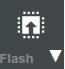

# User Manual

## Firmware Flashing

If you have a new puck.js, you will have to flash the firmware onto it. You can do this by the following steps:

1. Open the [Espruino Web IDE](https://www.espruino.com/ide/) in your browser **with Web Bluetooth support** (e.g. Chrome).
2. **Connect** the Puck.js in the IDE via Web Bluetooth (Top-left button: )
4. **Open** the firmware [main.js](src/espruino/main.js) in the Espruino Web IDE.
5. **Click** the "**Send to Espruino (Flash)** " button in the IDE to upload the firmware to your Puck.js.
   1. When the process is done, a message should appear in the console log on the left side.
6. **Disconnect** Puck.js from the Espruino IDE.

## Pairing as Mouse/Keyboard

In order to use the custom game station as a **mouse/keyboard** device you must **pair** it as a **Bluetooth device in the OS Bluetooth device manager**.

1. **Check** the device is **not connected** via Web Bluetooth or not connected to any other computer or smartphone.
2. **Connect** it via OS Bluetooth manager of your PC or smartphone/tablet.
   
Now the Game-Station is ready to be used.

## 🛠️ Mounting Specifications

Follow these instructions to correctly assemble and install the Custom Game Station on the wheelchair.

### 1. Component Assembly

1. **Joystick Core:** Insert the **Puck.js** microcontroller into the **Joystick Body**. Secure the assembly by snapping the **Joystick Cap** on top.
2. Put a silicon cover onto the joystick top to make it **waterproof**.
3. **Wiring & Connectivity:** Follow the established color code to connect the internal joystick wires.
4. **Side Control:** Attach the **Side Knee Button** to the **Side Holder**.

### 2. Wheelchair Preparation

* **Removal:** Carefully remove the original joystick handle from the wheelchair's joystick shaft.

### 3. Final Installation & Securing

* **Joystick:** Slide the new 3D-printed cover onto the joystick rod.
* **Top Cover:** Position the cover firmly onto the joystick base. To prevent movement and ensure a stable fit, attach two elastic bands to the lateral hooks:
    * One elastic band around the back side of the joystick base.
    * The second elastic band underneath the base.
* **Side Button Mounting:** Install the Side Holder onto the inner frame of the wheelchair. Adjust the screw to rotate and fix the button in the user's desired ergonomic position.
* **Final Connection:** Plug the cable from the side knee button into the main cover socket.

## Operation Modes

The joystick tilt can be translated to **mouse movement** or **WASD keypresses** and hence be used in different game actions.
The buttons support button press patterns and two types of press durations: 
* **Short-Press & Release**
* **Long-Press & Release**: Duration > 800ms.

### Calibration

Some wheelchair joysticks have a tilted zero position. In such a case the zero position must be calibrated to ensure proper operation:

* **Long-Press** the Top Button (T) and release it.

It is also possible to perform the calibration at anytime.

## Top Button (S)

The Top Button supports the following actions:

* **Short-Press**: <kbd>Tab</kbd> 
* **Long-Press**: Calibration

### Side-knee-button

* **Short-Press**: Left Mouse Click 
* **Long-Press**: Change of Mode
  * **Mouse movement**: The joystick tilt is translated into mouse movement. The mouse speed is according to the actual tilt level of the joystick.
  * **Hold of WASD keys**: <kbd>w</kbd>, <kbd>a</kbd>, <kbd>s</kbd>, <kbd>d</kbd> depending on joystick tilt direction.