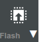

# User Manual

## Firmware Flashing for Puck.js

If you have a new puck.js, you will have to flash the firmware onto it. You can do this by the following steps:

1. Open the [Espruino Web IDE](https://www.espruino.com/ide/) in your browser **with Web Bluetooth support** (e.g. Chrome).
2. **Connect** the Puck.js in the IDE via Web Bluetooth (Top-left button: )
4. **Open** the firmware [Puck-js.js](/Puck-js.js) in the Espruino Web IDE.
5. **Click** the "**Send to Espruino (Flash)** " button in the IDE to upload the firmware to your Puck.js.
   1. When the process is done, a message should appear in the console log on the left side.
6. **Disconnect** Puck.js from the Espruino IDE.

## Firmware Flashing for Seeed XIAO nRF52840 Sense

If you have a new XIAO board, you will have to flash the firmware onto it. You can do this by the following steps:
1. Download [Arduino IDE](https://support.arduino.cc/hc/en-us/articles/360019833020-Download-and-install-Arduino-IDE).
2. Make sure that you have downloaded additional board manager URL's as shown below. Copy this [link](https://files.seeedstudio.com/arduino/package_seeeduino_boards_index.json) to the selected area.

   

3. Download **Seeed nRF52 Boards** package, through Tools-> Board-> Boards Manager as shown below.
   
4. Once the download is done, select the correct board through **Tools-> Board-> Seeed nRF52 Boards-> Seeed XIAO nRF52840 Sense**
   
   
5. When the download finishes, you are supposed to download library files for the accelerometer and gyroscope. For this, go on **Sketch-> Include Library-> Manage Libraries** and download **Seeed Arduino LSM6DS3** library.
   

6. When the download process is completed, you have to press _RST_ button twice, quickly on the XIAO board to make it ready to upload firmware.
   
   

8.  Copy this [code](https://raw.githubusercontent.com/SinttiM/Custom-Game-Station/refs/heads/main/XIAO%20nRF52840%20Sense), and paste it to the Arduino IDE, then click upload icon as attached below.
   
   

9. When the download process is completed, your Game-Station is ready to be used. All you need to do is to connect the joystick to the PC that you want to play games, via Bluetooth. Advertising name for the device **XIAO-HID**. You can connect your PC as attached below, and then you can start using the joystick.
    

In order to use the custom game station as a **mouse/keyboard** device you must **pair** it as a **Bluetooth device in the OS Bluetooth device manager**.

1. **Check** the device is **not connected** via Web Bluetooth or not connected to any other computer or smartphone.
2. **Connect** it via OS Bluetooth manager of your PC or smartphone/tablet.
   
Now the Game-Station is ready to be used.

## 🛠️ Mounting Specifications

Follow these instructions to correctly assemble and install the Custom Game Station on the wheelchair.

### 1. Wheelchair Preparation

* **Removal:** Carefully remove the original joystick handle from the wheelchair's joystick shaft.

### 2. Component Assembly

1. Place the elastic band over the wheelchair joystick shaft.
2. Hold the elastic band in place and press the custom joystick onto the shaft so that the marked dot points forward from the user's perspective.
3. Turn the joystick power switch **ON (Position 1)**.
    * In the center position and **Position 2**, the joystick is disconnected from the battery.
4. **Charging the device (optional):**
    * Attach the magnetic charging cable to the bottom of the joystick.
    * Connect the USB end to a computer.
    * Ensure that the joystick power switch is in **Position 1** so the battery is connected and charging can occur.
5. Attach the **Knee Button Holder** underneath the wheelchair control unit and secure it using the bolt.
6. Insert the **Puck.js** into its designated slot inside the **Knee Button Holder**.

### 3. Computer Preparation

1. Enable **Bluetooth** on the computer.
2. Connect to the new device named **XIAO-HID**.
3. Once connected, the system is ready for use.

### 4. Operation Modes

#### Joystick Mode

The joystick emulates keyboard movement controls:

* Move **up** → Presses **W**
* Move **down** → Presses **S**
* Move **right** → Presses **D**
* Move **left** → Presses **A**

#### Mouse Mode

* Press and hold the **Puck.js** button to switch joystick functionality into **mouse control mode**.

### 5. Recommended Accessories

For an improved gaming experience, additional external buttons are recommended for:

1. **Jump**
2. **Crouch**
3. **Object Selection / Interaction**

